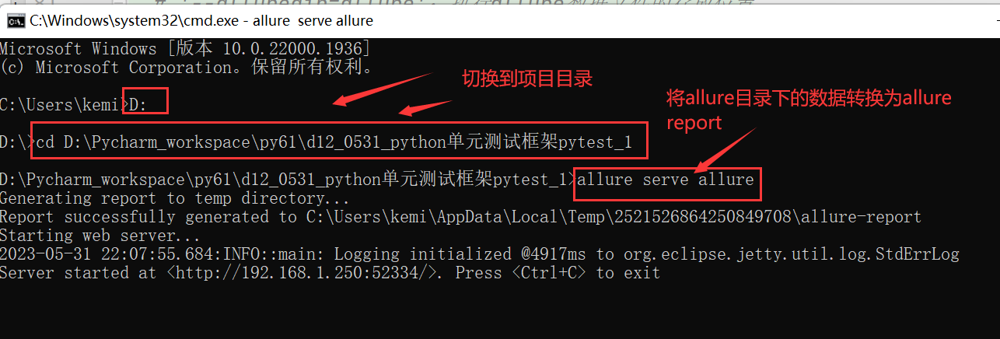

## 一、pytest框架入门使用
### 1、没有框架的时候，能够做自动化测试
- 思考：没有框架能否进行自动化测试？  ---可以进行自动化测试
  - 自动化测试？  明确需求--用例的设计--编写脚本--执行脚本----得到测试结果----结果汇报
  - 任务：针对登录功能进行测试，
    - 1、明确需求：用户名：admin，密码：123456--登录成功，否则提示登录失败，用户名或密码不能为空
    - 2、设计用例：
      - case1: 测试数据：admin,123456，期望结果：登录成功
      - case2: 测试数据：admin,122222，期望结果：提示登录失败
      - case3: 测试数据：用户名为空,123456，期望结果：提示用户名或密码不能为空
      - case4: 测试数据：admin,密码为空，期望结果：提示用户名或密码不能为空
      - .....
    - 3、执行用例：
      - 功能测试:手工去执行用例，记录用例执行结果（通过/不通过），提交bug
      - 自动化测试：准备脚本/使用工具来实现用例，执行脚本，并且记录用例执行的结果
    - 4、测试结果总结以及汇报
- 带来的问题：
  - 没有框架的时候，可以做自动化测试，但是存在有一些问题
  - 1）当用例执行失败的时候，直接中断代码，导致部分用例无法去执行，用例执行的时候考虑排序问题
  - 2）编写用例和执行用例过程相对来说比较繁琐，有很多重复的操作
  - 3）测试结果没有一一对应的显示,没有汇总信息
  - 4）前置条件？数据驱动？测试报告？

### 2、什么是框架？为什么要用这个框架？主流框架有哪些？
- 1、框架：工具的集合，可以快速实现功能（需求），但是你要遵循他设置的规范或原则
- 2、框架：
  - 单元测试框架：pytest、unittest...
    - 单元测试是指对软件中的最小可测试单元进行检查和验证，以确保它们按照预期正常工作。最小可测试单元通常是单个函数、方法或类，在面向对象编程中有时称为“单元”。 
    - unittest是python自带的框架，容易入门，使用简单，操作有一点点繁琐
    - pytest是第三方的框架（用之前必须先安装），功能全面，使用简单，插件丰富
      - 安装pytest:
        - pycharm-Terminal方式一:pip install pytest
        - cmd方式二:pip install pytest
      - 查看是否安装成功：
        - pip show pytest
  - web自动化框架：selenium,RF,cypress,playwright...
  - app自动化框架: appium.....
  - 接口自动化框架：requests

### 3、pytest框架入门使用
- 1）使用pytest框去写测试用例 
  - pytest框架规则
    - 1)测试文件（py文件）名称：必须以test_开头，或者以_test结尾
    - 2)用例是用函数来写的，函数名必须以test开头
    - 3)用例是写在类中函数，类名必须以Test开头
- 2）如何执行用例
  - 不需要手动调用函数（测试用例）来进行用例的执行
  - 使用pytest模式进行文件执行，执行文件的时候就会自动识别并收集用例来进行自动执行
    - 设置pytest模式执行方式：https://blog.csdn.net/weixin_56301225/article/details/122360033
  - 执行单条用例：用例前面的三角形
  - 执行py文件中的所有用例：把光标放到最后面代码的空行上，右击--run执行
  - 执行多个py文件中的所有用例，可以去写一个执行的主入口文件（推荐：run.py 、main.py），在主入口文件中进行执行

- 3）有框架  VS  没有框架 对比
  - 1：有框架的时候，不需要手动调用函数来触发用例的执行；没有框架的自动化脚本，一定要通过手动调用才能执行用例
  - 2：有框架的时候，用例执行失败不会中断代码，其他用例正常执行；没有框架的自动化脚本，用例执行失败会直接中断，导致其他用例无法执行
  - 3：有框架的时候，用例执行结果显示是很明确的，而且有汇总信息；没有框架的自动化脚本，用例执行结果不明确
  - 4：有框架的时候，可以直接生成比较美观HTML报告；没有框架的自动化脚本则难以实现

- 4）生成测试报告
  - pytest结合allure生成美观、漂亮、高大尚HTML测试报告
  - allure环境安装步骤：
    - 1：安装和配置allure
      - 今天晚上我们开始讲pytest框架咯，课上会用到allure环境，小伙伴们尽量在上课前把环境准备好，下载和安装请查看文档中第5点（allure工具安装），文档地址：https://cold-fox-f95.notion.site/python-d558cc750e834387a3ee3e3ccacc01bd#29665087686b4c4a89bf0c14a6fb9e5c
      - allure安装必须要有JDK环境，没有JDK环境的同学首先要把JDK装好，然后再去装allure，JDK下载和安装查看文档中第3点（jdk11安装），文档地址同上
      - mac上安装配置allure，可以参考：https://blog.csdn.net/qq_42059883/article/details/121221673
    - 2: 安装一个插件allure-pytest：另安装
      - pycharm-Terminal方式一:pip install allure-pytest
      - cmd方式二:pip install allure-pytest
  - 使用代码生成HTML报告
    - 主入口文件(用来执行所有的用例文件)：run.py ----执行执行
```python
  import pytest
  
  args = ['-s','-v','--html=report.html','--alluredir=allure',,'--clean-alluredir']
  pytest.main(args = args)
  
  # args中参数的含义：
  # -s：显示用例中print打印的信息
  # -v: 记录执行用例的详细过程
  # '--html=report.html'：生成一个HTML格式的测试报告
  # '--alluredir=allure'：执行allure数据文件的存放位置
  # '--clean-alluredir':清空allure目录下的数据文件
```
  - 在cmd执行命令，将allure目录下的数据文件转换为HTML报告
    - 第一步：切换项目目录:D:\Pycharm_workspace\py61\d12_0531_python单元测试框架pytest_1
    - 第二步：allure serve allure数据的目录
    

    
## 二、pytest框架的高阶使用
### 1、pytest的参数化实现（DDT数据驱动）

### 2、pytest前置/后置处理

### 3、pytest框架的综合运用