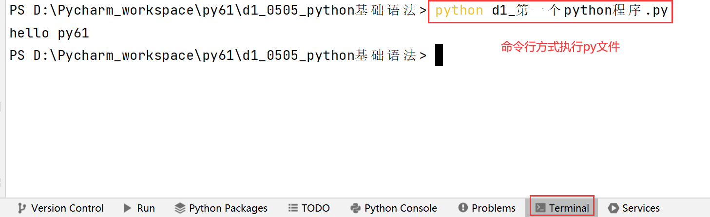
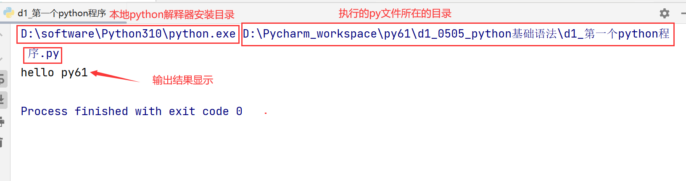

- 回顾：开班典礼
- 1、解决了6个问题
- 2、安装自动化测试环境
  - python解释器环境
  - pycharm编码工具
- 3、pycharm创建工程
  - 选择你本地装好的python解释器环境
  - pycharm创建工程要能够找到位置

## 一、pycharm基本使用
- 1、创建一个工程-py61
- 2、创建文件夹：来管理每节课的代码+笔记内容
  - director:普通文件
  - python package:包  ---后续自动化学习过程中，推荐这个
- 3、创建python文件
  - python file    ----文件名，后缀.py会自动加上   ---》推荐这种方式来创建
  - file   ----一定要写上文件名.py
- 4、执行python文件
  - 右击--run
  - 右上角绿色三角形
  - 文件夹下py文件--右击--run
  - 菜单--run--run文件
  - 控制台左边-绿色三角形
  - 快捷方式：ctrl+shift+F10
  - 命令方式来执行：Terminal--->python 文件名

- 5、结果输出:控制台
  -

## 二、基本语法规则
- 1、注释
  - 注释信息不是代码，注释信息就是解释代码
  - 给人看，很快能通过这个注释理解到代码含义（代码实现的功能）
  - 两种方式：#（快捷键：ctrl+/） 、 三引号
- 2、层级的控制
  - 缩进来控制层级，一般使用tab键来做缩进
- 3、报错
  - 明显标记：红色的波浪线
  - 1）找到哪个文件、哪行代码报错
  - 2）报错信息是什么  ---英文的报错信息，学会用翻译去看懂
  - 3）学会用调试

## 三、变量
- 1、变量：存储数据容器
  - 声明变量：变量名 = 值
  - python中变量名严格区分大小写，age/Age/AGE是三个不同的变量

  - 2、标识符的命名规范（变量名、函数名、类名、文件名、包名）
    - 1）只能由数字、字母、下划线组成
    - 2）且不能以数字开头
    - 3）不能和内置关键字冲突
    ```python
    ['False', 'None', 'True', 'and', 'as', 'assert', 'async', 'await', 
    'break', 'class', 'continue', 'def', 'del', 'elif', 'else', 'except',
    'finally', 'for', 'from', 'global', 'if', 'import', 'in', 'is', 
    'lambda', 'nonlocal', 'not', 'or', 'pass', 'raise', 'return', 
    'try', 'while', 'with', 'yield']
    ```
    - 4）规范：命名最好做到见名知意，由多个单词组成的变量名，下划线分隔法total_price，驼峰命名法TotalPrice

## 四、输入输出
- 1、输出方法：
  - print(内容)   输出内容后默认自动换行
  - print('内容1','内容2','内容3')
  - print('hello py61',end = '')   输出内容后不换行 
- 2、输入方法：
  - input('提示信息'):可以从控制台接收输入的数据
  - 好处：可以动态的获取数据

## 五、数据类型
- 了解：python是一种弱类型语言，java强类型语言

- type(值/变量):返回值/变量的数据类型（关键字）
- 1、数字类型
  - 整数（int）
  - 浮点数(float)
  - 布尔值(bool):只有2种取值，True/False
- 2、字符串类型(str)
- 3、列表(list)
- 4、元组(tuple)
- 5、字典(dict)
- 6、集合(set)

## 六、运算符
- 1、算数运算符：+  -  *  /   //   %
  - 所有的数字类型（整数、浮点数、布尔值）都可以进行运算，True用作运算的时候，等同于1，False用作运算的时候，等同于0

- 2、比较运算符：>  <  >=  <=  ==   !=
  - 得到的结果永远是bool类型

- 3、逻辑运算符

- 4、成员运算符

- 5、赋值运算：= +=  -=  *=  /=  //=  %=
  - 变量的声明就是一种赋值运算符：age = 18

- 不常用
- 6、位运算符：&、|、^、~、<<、>>

- 7、身份运算符：is、is not

## 七、类型转换(数字类型中的互相转换)
- 1、浮点数/布尔值转为整数
  - int(值)
  - 浮点数---整数，只保留整数部分
  - 布尔值---整数，True=1,False=0

- 2、整数/布尔值转为浮点数
  - float(值)
  - 整数---浮点数，整数.0
  - 布尔值---浮点数，True=1.0,False=0.0

- 3、整数/浮点数转为布尔值
  - bool(值)
  - 非零值---True 
  - 0/0.0---False
