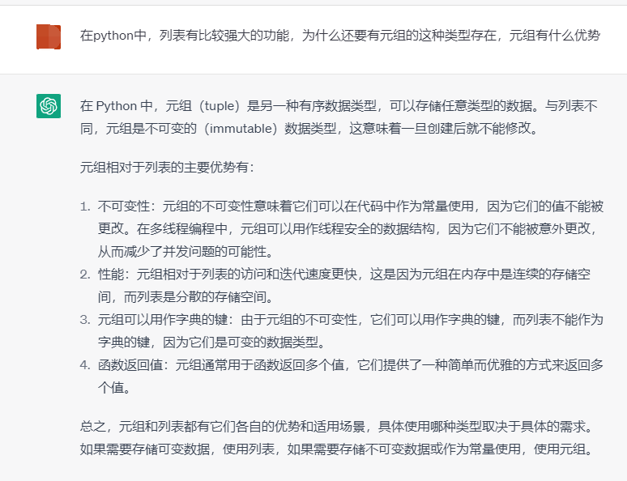

## 一、数据类型-列表
- 1、列表的基本定义
  - 作用：可以一次存储多个数据的类型，每个数据叫做元素，元素可以是任意类型，元素之间用逗号隔开。列表中存储的元素类型是一致。
  - 标识符：[]
  - 关键字：list
  - 类型：type()
  - 长度：len()
  - 特点：有序可变，有序：有索引值，可变：列表中的元素是可以增加、删除、修改

- 2、列表操作
  - 列表的常见操作：针对列表中的元素值去进行增加、删除、修改、查看操作
  - 1）查看---使用频率是最高
    - 列表中每个元素都是有索引值，索引值的编号方式和字符串是一样的，正序索引，反序索引
    - 获取列表中单个元素语法：列表名[索引值]
      - 得到的结果和元素的数据类型是一致
    - 获取列表中多个元素语法：列表名[start:end:step]
      - 得到的结果的数据类型也是一个列表
      - 针对切片操作的其他场景同字符串操作一致
      - 列表倒序输出：列表名[::-1]
 
  - 2）增加
    - 列表名.append(值)   ----在列表的末尾去添加元素值
    - 列表名.insert(索引值,值)   ---在列表的指定位置去添加元素
    - 合并列表：列表1 + 列表2    ---合并列表，得到一个新列表
    - 列表1.extend(列表2)  ---将列表2合并到列表1中

  - 3）删除
    - 列表名.remove(元素值)
      - 元素值有多个的时候，只会删除找到第一个元素值
      - 元素值不存在的时候，会报错
    - 列表名.pop(索引值)
      - 索引值不存在的时候，也会报错
    - 列表名.clear()

  - 4）修改
    - 列表名[索引值] = 新的值

- 3、列表内置函数
  - 列表中的元素求和,sum(列表名)
  - 列表中元素的排序：
    - 列表名.sort()   ---升序排列，从小到大排序
    - 列表名.sort(reverse = True)  ---降序排列，从大到小排序
  - 倒序输出：列表名.reverse()
  - 获取元素的索引值：列表名.index(元素)

## 二、数据类型-元组
- 1、元组的基本定义
  - 作用：可以一次存储多个数据的类型，每个数据叫做元素，元素可以是任意类型，元素之间用逗号隔开。
  - 标识符：()
  - 关键字：tuple
  - 类型：type()
  - 长度：len()
  - 特点：有序不可变，有序有索引值，不可变：元组中的元素定义后，不能进行增加、删除和修改操作
  - 元组中只有一个元素，那么一定要在元素后面带上逗号

- 2、元组操作
  - 元组的操作主要就是查看
    - 元组名[索引值]
    - 元组名[start:end:step]
    - 疑问：在python中，列表有比较强大的功能，为什么还要有元组的这种类型存在，元组有什么优势

- 3、元组内置函数
  - 获取元素的索引值：元组名.index(元素)

## 三、转换函数
- list():将其他类型转为列表，
  - 元组可以转为列表
  - 字符串可以转为列表
- tuple()：将其他类型转为元组，
  - 列表可以转为元组
  - 字符串可以转为元组

### 四、总结
- 列表和元组的区别：
  - 1、关键字不同的，列表list,元组tuple
  - 2、列表是有序可变的，元组是有序不可变
  - 3、只包括一个元素的时候，定义语言不同，元组一定要在元素后面加上逗号，但是列表不需要
  - ....